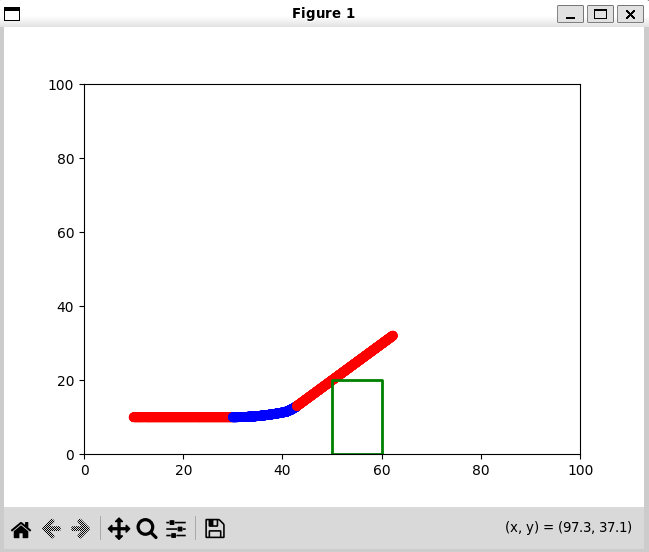

# cpp-2d-robot-sim

Multithreaded robot simulation in C++17. A differential-drive robot navigates a 2D world with obstacles using raycasting for obstacle detection.

Built to learn C++ concurrency patterns, RAII, and proper header/source separation.

## Architecture

Three worker threads run concurrently:

| Worker | Reads | Writes | Role |
|--------|-------|--------|------|
| RobotWorker | sensor_mutex | state_mutex | Control loop: read sensors → decide → integrate physics |
| WorldWorker | state_mutex | sensor_mutex | Raycast from robot pose → update sensor data |
| ReporterWorker | state_mutex, sensor_mutex | stdout | Print pose and sensor readings for visualisation |

Shared state is protected by mutexes. Each worker inherits from `WorkerBase` which handles thread lifecycle (start/stop/join) with proper RAII cleanup.



## Structure

```
thread-bot/
├── src/
│   ├── main.cpp              # Setup, spawn workers, sleep, shutdown
│   ├── types.hpp             # Vec2, Pose2D, Obstacle, RobotState, SensorData
│   ├── robot.hpp/cpp         # Differential drive physics
│   ├── world.hpp/cpp         # Obstacles, collision, raycasting
│   ├── worker.hpp/cpp        # Base class for threaded workers
│   ├── shared_context.hpp    # Mutexes + shared state
│   ├── robot_worker.hpp/cpp  # Control loop
│   ├── world_worker.hpp/cpp  # Sensor simulation
│   └── reporter_worker.hpp/cpp # Logging
└── plot.py                   # Real-time matplotlib visualisation
```

## Build & Run

```bash
cmake -B build -S .
cmake --build build
build/thread_bot | python plot.py
```

Requires Python with matplotlib for visualisation.

## Key Concepts

**Threading**: `std::thread`, `std::mutex`, `std::lock_guard`, `std::atomic<bool>` for shutdown signalling.

**RAII**: `WorkerBase` destructor calls `stop()` then `join()` - threads clean up automatically when workers go out of scope.

**Ownership**: `std::unique_ptr` for World, Robot, SharedContext. Workers receive raw pointers (non-owning).

**Const correctness**: `const&` for input parameters, `const` member functions for read-only methods, `mutable` for mutexes in const contexts.